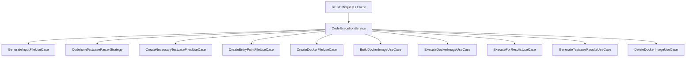

# `common-code-execution` Technical Documentation & Logic Breakdown

The `common-code-execution` module is the shared, non-blocking code execution engine for the **CodeHorn** platform. Built with **Kotlin Coroutines (`suspend` functions, `Dispatchers.IO`)** and **Spring WebFlux**, it safely compiles, executes, and evaluates user-submitted source code inside isolated Docker containers against testcases.

---

## 1. High-Level Architecture

The module utilizes a **Clean Architecture (Use-Case driven)** model:



### Key Components

1. **`CodeExecutionService`**: The central orchestrator coordinating all execution use-cases asynchronously.
2. **Provider Interfaces**:
   * `ExecutionParametersProvider`: Supplies source file names (`Main.java`, `Main.cpp`, `Main.py`, `Main.js`) and compiler base image tags (`amazoncorretto:21`, `gcc:9.5.0`, `node:21`).
   * `EntryPointProvider`: Generates the bash test execution script (`entrypoint.sh`).
   * `VolumeMountPathProvider`: Provides host source folder paths (e.g. `/tmp/codehorn/executions/java/{executionId}`) and container destination paths (`/app`).
3. **`TestcaseParserStrategy`**: Bitmask-based parser converting structured JSON inputs into plain-text input files for standard input (`STDIN`) reading.

---

## 2. Step-by-Step Logic with Concrete Examples

### Example Scenario: Two-Sum Problem in Java

A user submits a Java solution for Two-Sum with Execution ID `exec-99`:

* **Target Target Filename**: `Main.java`
* **Docker Image Target**: `amazoncorretto:21`
* **Target Host Path**: `/tmp/codehorn/executions/java/exec-99`

---

### Step 1: Input Code Generation ([GenerateInputFileUseCase](codehorn-backend/common-code-execution/src/main/kotlin/com/techullurgy/codehorn/common/code/execution/usecases/GenerateInputFileUseCase.kt))

Writes the user's raw Java source code to disk: `/tmp/codehorn/executions/java/exec-99/Main.java`.

#### Example Submitted Code (`Main.java`):
```java
import java.util.Scanner;

public class Main {
    public static void main(String[] args) {
        Scanner scanner = new Scanner(System.in);
        int n = scanner.nextInt();
        int[] nums = new int[n];
        for (int i = 0; i < n; i++) {
            nums[i] = scanner.nextInt();
        }
        int target = scanner.nextInt();
        
        for (int i = 0; i < n; i++) {
            for (int j = i + 1; j < n; j++) {
                if (nums[i] + nums[j] == target) {
                    System.out.println(i + " " + j);
                    return;
                }
            }
        }
    }
}
```

---

### Step 2: Testcase Bitmask Parsing ([CodehornTestcaseParserStrategy](codehorn-backend/common-code-execution/src/main/kotlin/com/techullurgy/codehorn/common/code/execution/parsers/CodehornTestcaseParserStrategy.kt))

Testcase inputs arrive as JSON strings with associated `Long` type bitmasks (`TestcaseTypeMasks`):

#### Bitmask Definitions:
* `INT_TYPE` = `1L << 1`
* `SINGLE_TYPE` = `1L << 11` (Scalar)
* `LIST_TYPE` = `1L << 12` (1D Array)

#### Example Input Problem Testcase:
* **Inputs**: `["[2, 7, 11, 15]", "9"]`
* **Masks**: `[LIST_TYPE | INT_TYPE, SINGLE_TYPE | INT_TYPE]`

#### Parser Operations:
1. `inputs[0]` is a 1D Array of Integers: Parses array size (`4`) on line 1, followed by each element (`2`, `7`, `11`, `15`) on lines 2-5.
2. `inputs[1]` is a single Integer: Parses scalar value (`9`) on line 6.

#### Generated Plain-Text Stream (`sample-input1.txt`):
```text
4
2
7
11
15
9
```

`CreateNecessaryTestcaseFilesUseCase` saves this file under `/tmp/codehorn/executions/java/exec-99/testcases/sample-input1.txt`.

---

### Step 3: Bash Entrypoint Script Generation ([CreateEntryPointFileUseCase](codehorn-backend/common-code-execution/src/main/kotlin/com/techullurgy/codehorn/common/code/execution/usecases/CreateEntryPointFileUseCase.kt))

Generates `entrypoint.sh` inside the execution workspace. This bash script runs inside the container to compile, run tests with timeouts, and check outputs.

#### Example Generated `entrypoint.sh`:
```bash
#!/bin/bash
set -e

# 1. Compile Code
javac Main.java 2> outputs/compilation_err.log || {
  echo "COMPILATION_ERROR";
  exit 1;
}

# 2. Run Sample Testcases
(
  set +e
  failed=0

  for i in 1; do
    timeout 5s java Main < testcases/sample-input"$i".txt > outputs/result"$i".txt 2> outputs/sample-outerr"$i".log
    exit_code=$?

    if [[ $exit_code -eq 124 ]]; then
      echo "$i-TIME_LIMIT_EXCEEDED"
      failed=124
    elif [[ $exit_code -ne 0 ]]; then
      echo "$i-RUNTIME_ERROR"
      failed=1
    else
      if cmp -s outputs/eResult"$i".txt outputs/result"$i".txt; then
          echo "$i-ACCEPTED"
      else
          echo "$i-WRONG_ANSWER"
          failed=1
      fi
    fi
  done

  if [[ $failed -ne 0 ]]; then
    exit 1
  fi
) || exit 1

# 3. Run Hidden Testcases
for i in 2 3; do
  timeout 5s java Main < testcases/hidden-input"$i".txt > outputs/result"$i".txt 2> outputs/hidden-outerr"$i".log
  exit_code=$?

  if [[ $exit_code -eq 124 ]]; then
    echo "$i-TIME_LIMIT_EXCEEDED"
    exit 1
  elif [[ $exit_code -ne 0 ]]; then
    echo "$i-RUNTIME_ERROR"
    exit 1
  else
    if cmp -s outputs/eResult"$i".txt outputs/result"$i".txt; then
        echo "$i-ACCEPTED"
    else
        echo "$i-WRONG_ANSWER"
        exit 1
    fi
  fi
done
```

---

### Step 4: Dynamic Dockerfile Generation ([CreateDockerFileUseCase](codehorn-backend/common-code-execution/src/main/kotlin/com/techullurgy/codehorn/common/code/execution/usecases/CreateDockerFileUseCase.kt))

Generates `/tmp/codehorn/executions/java/exec-99/Dockerfile`:

```dockerfile
FROM amazoncorretto:21
ADD ./Main.java /app/Main.java
COPY ./testcases /app/testcases
ADD ./entrypoint.sh /app/entrypoint.sh
ENV MOUNT_BASE_PATH /app
WORKDIR /app
RUN chmod +x entrypoint.sh
ENTRYPOINT ["./entrypoint.sh"]
```

---

### Step 5: Asynchronous Docker Image Build & Container Sandbox Execution

Both build and execution run non-blockingly using Kotlin Coroutines on `Dispatchers.IO`:

1. **`BuildDockerImageUseCase`** ([BuildDockerImageUseCase](codehorn-backend/common-code-execution/src/main/kotlin/com/techullurgy/codehorn/common/code/execution/usecases/BuildDockerImageUseCase.kt)):
   Runs `docker build -t code-image-exec-99 /tmp/codehorn/executions/java/exec-99`.
2. **`ExecuteDockerImageUseCase`** ([ExecuteDockerImageUseCase](codehorn-backend/common-code-execution/src/main/kotlin/com/techullurgy/codehorn/common/code/execution/usecases/ExecuteDockerImageUseCase.kt)):
   Executes container with `/outputs` volume mounting:
   ```bash
   docker run --rm -v /tmp/codehorn/executions/java/exec-99/outputs:/app/outputs --name code-image-exec-99-container code-image-exec-99
   ```
   Includes a 2-minute safety watchdog. If execution exceeds 2 minutes, it calls `docker stop code-image-exec-99-container` and terminates the process.

---

### Step 6: Output Classification & Result Parsing ([ExecuteForResultsUseCase](codehorn-backend/common-code-execution/src/main/kotlin/com/techullurgy/codehorn/common/code/execution/usecases/ExecuteForResultsUseCase.kt) & [GenerateTestcaseResultsUseCase](codehorn-backend/common-code-execution/src/main/kotlin/com/techullurgy/codehorn/common/code/execution/usecases/GenerateTestcaseResultsUsecase.kt))

#### Raw Container Stdout Captured:
```text
1-ACCEPTED
2-ACCEPTED
3-WRONG_ANSWER
```

#### Mapping Output Strings to `CodeSubmissionResult` Enums:
* `1-ACCEPTED` $\rightarrow$ `testcaseId: "1"` $\rightarrow$ `CodeSubmissionResult.Accepted`
* `2-ACCEPTED` $\rightarrow$ `testcaseId: "2"` $\rightarrow$ `CodeSubmissionResult.Accepted`
* `3-WRONG_ANSWER` $\rightarrow$ `testcaseId: "3"` $\rightarrow$ `CodeSubmissionResult.WrongAnswer`

#### File Log Extraction:
`GenerateTestcaseResultsUseCase` reads captured standard outputs (`result1.txt`), expected outputs (`eResult1.txt`), standard errors (`sample-outerr1.log`), and compilation logs (`compilation_err.log`) to construct the final `TestcaseResult` DTO list.

---

### Step 7: Ephemeral Clean Up ([DeleteDockerImageUseCase](codehorn-backend/common-code-execution/src/main/kotlin/com/techullurgy/codehorn/common/code/execution/usecases/DeleteDockerImageUseCase.kt) & [UserFolderCreator](codehorn-backend/common-code-execution/src/main/kotlin/com/techullurgy/codehorn/common/code/execution/services/UserFolderCreator.kt))

1. Executes `docker rmi code-image-exec-99:latest` via `withContext(Dispatchers.IO)` to prevent Docker storage accumulation.
2. `UserFolderCreator.use { ... }` closes the host folder context cleanly.

---

## 3. End-to-End API Example

### HTTP POST Request (`/api/v1/java/execute`)

```json
{
  "executionId": "exec-99",
  "fileContent": "import java.util.Scanner;\npublic class Main {\n  public static void main(String[] args) {\n    Scanner s = new Scanner(System.in);\n    int a = s.nextInt(), b = s.nextInt();\n    System.out.println(a + b);\n  }\n}",
  "testcases": [
    {
      "id": "tc-01",
      "isHidden": false,
      "inputNames": ["a", "b"],
      "inputs": ["5", "10"],
      "masks": [2050, 2050]
    }
  ]
}
```

### HTTP 200 OK Response

```json
[
  {
    "testcaseId": "tc-01",
    "expectedResult": "15\n",
    "yourResult": "15\n",
    "stdout": "15\n",
    "stderr": "",
    "compilationError": "",
    "result": "ACCEPTED"
  }
]
```
