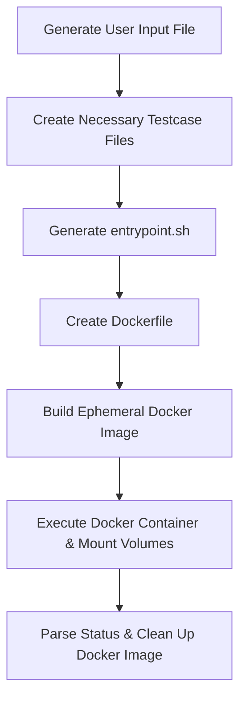

# CodeHorn Backend Technical Documentation

## Module: `common-code-execution`

The `common-code-execution` module is the shared execution engine in `codehorn-backend`. It provides a secure, containerized, sandboxed environment for executing untrusted user-submitted code and evaluating testcases across multiple programming languages.

---

## 1. High-Level Architecture & Design Patterns

The module follows Clean Architecture principles combined with Spring Dependency Injection:

* **Use-Case Driven Design**: Core business operations are encapsulated into single-responsibility Spring `@Component` classes that override Kotlin's `operator fun invoke(...)`.
* **Pluggable Provider Pattern**: Language-specific microservices (`java-execution-service`, `python-execution-service`, `cpp-execution-service`, etc.) inject specialized providers to customize execution behavior:
  * `ExecutionParametersProvider`: Configures compiler Docker image and source file naming (e.g. `Main.java`, `Main.cpp`, `Main.py`).
  * `EntryPointProvider`: Generates container bash script blueprints (`entrypoint.sh`).
  * `VolumeMountPathProvider`: Manages volume mounts connecting host user workspace folders to container destination paths (`-v hostPath/outputs:containerPath/outputs`).
* **Container-Based Sandboxing**: Untrusted code is isolated inside ephemeral Docker containers running under strict execution timeouts (2-minute container wait timeout with automatic process kill & container deletion).

---

## 2. Code Execution Pipeline

The execution process is orchestrated by `CodeExecutionService.executeFor()`:



### Pipeline Steps Breakdown:

1. **`GenerateInputFileUseCase`**  
   Writes the user's source code string into the workspace folder (e.g., `Main.java`, `Main.cpp`, `Main.py`).
2. **`CreateNecessaryTestcaseFilesUseCase`**  
   Writes input (`in.txt`) and expected output (`out.txt`) files into the `testcases/` subfolder, differentiating sample and hidden testcases.
3. **`CreateEntryPointFileUseCase`**  
   Uses `EntryPointProvider` and `DefaultTestcaseProvider` to generate an `entrypoint.sh` bash script responsible for running/compiling the user code inside the container.
4. **`CreateDockerFileUseCase`**  
   Constructs a dynamic `Dockerfile` targeting the required language compiler base image (e.g. `amazoncorretto:21`, `gcc:9.5.0`, `node:21`).
5. **`BuildDockerImageUseCase`**  
   Triggers `docker build -t code-image-<executionId>` on the host directory.
6. **`ExecuteDockerImageUseCase`**  
   Executes `docker run --rm -v ...` with output directory volume mounting. Includes a 2-minute safety watchdog that forces container destruction (`docker stop`) if execution hangs.
7. **`ExecuteForResultsUseCase` & `GenerateTestcaseResultsUseCase`**  
   Evaluates container standard output, standard error, compilation logs, expected vs. actual outputs, and returns `TestcaseResult` list.
8. **`DeleteDockerImageUseCase`**  
   Purges the ephemeral Docker image from the host system to prevent container storage growth.

---

## 3. Testcase Parsing Logic

The testcase parser converts raw JSON testcase payloads into normalized newline-delimited plain-text input streams (`in.txt`) that submitted programs can read standard input from (`cin`, `Scanner`, `input()`).

### Bitmask Type Encoding Schema (`TestcaseTypeMasks`)

Input types and structures are encoded into bitmasks (`Long`):

```text
Data Type Bits (1-4):
- INT_TYPE         = 1L << 1
- LONG_TYPE        = 1L << 2
- DOUBLE_TYPE      = 1L << 3
- STRING_TYPE      = 1L << 4

Collection Structure Bits (11-16):
- SINGLE_TYPE      = 1L << 11  (Scalar)
- LIST_TYPE        = 1L << 12  (1D Array)
- LIST_LIST_TYPE   = 1L << 13  (2D Matrix)
- SINGLE_NULL_TYPE = 1L << 14
- LIST_NULL_TYPE   = 1L << 15
- LIST_LIST_NULL_  = 1L << 16
```

### Stream Serialization Formats (`CodehornTestcaseParserStrategy`)

* **Scalar Primitive (`SINGLE` / `SINGLE_NULL`)**:  
  Appends value + `\n`. Emits `null\n` if null input is allowed.
* **1D Array (`LIST` / `LIST_NULL`)**:  
  1. Emits total length **`N`** on a new line.
  2. Emits each of the **`N`** elements on subsequent lines.
* **2D Matrix (`LIST_LIST` / `LIST_LIST_NULL`)**:  
  1. Emits total row count **`R`** on a new line.
  2. For each row `r`, emits column length **`C_r`** on a new line followed by each element in that row on subsequent lines.

---

## 4. Evaluation & Result Classification

`ExecuteForResultsUseCase` maps container outputs to domain result statuses:

| Status Enum | Description |
| :--- | :--- |
| `ACCEPTED` | Code executed cleanly and output matched expected testcase output. |
| `WRONG_ANSWER` | Execution finished, but output differed from expected result. |
| `TIME_LIMIT_EXCEEDED` | Container execution exceeded maximum allowable runtime threshold. |
| `RUNTIME_ERROR` | Program threw an unhandled exception or non-zero exit code during execution. |
| `COMPILATION_ERROR` | Compiler failed during build step (log saved to `compilation_err.log`). |
| `NotExecuted` | Default unexecuted state when image creation fails or prior step aborts. |

---

## 5. Supported Compiler Specifications

Defined in `Compiler.kt`:

| Programming Language | Docker Base Image | Target Source Filename |
| :--- | :--- | :--- |
| **C** | `gcc:9.5.0` | `Main.c` |
| **C++** | `gcc:9.5.0` | `Main.cpp` |
| **Java** | `amazoncorretto:21` | `Main.java` |
| **JavaScript** | `node:21` | `Main.js` |
| **Python 3** | `gcc:9.5.0` | `Main.py` |
